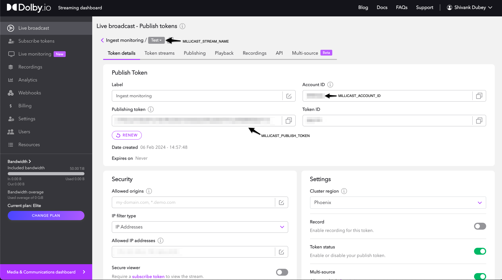
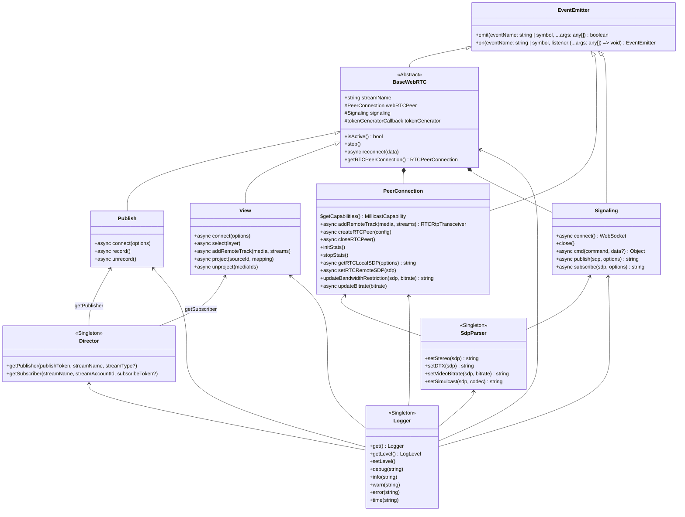

# Develop in Millicast SDK

## Packages

This project is built with [Lerna](https://lerna.js.org/) and contains the following packages:

- `millicast-sdk`: The SDK itself.
- `millicast-publisher-demo`: Publisher demo page using SDK. You can try this demo [here](https://demo.millicast.com/?codec=h264&nosimulcast).
- `millicast-viewer-demo`: Viewer demo page using SDK.
- `millicast-chromecast-receiver`: Example of Google Cast receiver for demo.

## Development

Asumming that you have Node 12.10.x or newer and `npm` installed, install the required dependencies running:

```sh
npm ci
```

### Changesets

Whenever you are working on a new feature, fix or change, make sure you create a **changeset** with a description of the change. Follow [this](.changeset/README.md#Changes-per-feature) guide for further understanding.

### Building packages

As the project is built using [Lerna](https://lerna.js.org/), we can rely on it to manage our packages dependencies, so you just need to run at project's root directory

```sh
npm run prepare
```

You will need to add a `.env` file in all demo packages (`packages/millicast-publisher-demo`, `packages/millicast-viewer-demo`, `packages/millicast-chromecast-receiver`, `packages/millicast-multiview-demo` & `packages/millicast-webaudio-delay-demo`). You can simply copy the `.env.sample` to get started:

> note : The `.env` is typically not added to git. When you clone the repo, you will not find this file and will have to create one yourself. The `.env.example` app can be used as a template with basic keys. Rename the file to `.env` and insert your tokens to get the file up and running.

```sh
# Make a .env file with the following vars
MILLICAST_STREAM_NAME=test
MILLICAST_ACCOUNT_ID=test
MILLICAST_PUBLISH_TOKEN=test
```

These tokens can be found in your [Dolby.io dashboard](https://streaming.dolby.io/#/tokens).



Then, build all packages:

```sh
npm run build
```

Optionally you can run other Lerna commands using `$ npx lerna [command]`.

### Running demo

If you want to add, fix or edit features in the SDK or just try our demo pages, run the following command:

```sh
npm run start
```

> Please note that before you run `npm run start`, you need to have built the solution first using `npm run build`

It opens all the demo apps in your browser and keeps watching for changes in all the packages. You only need to refresh both pages if you modify the code.

### Running tests
If you want to run all tests, run:
```sh
npm run test
```

> Note: There are some requirements to take into account before running E2E tests. Make sure to take a look at [those](#e2e-testing).

#### Unit testing
If you want to run only unit tests, then you have to move to the `millicast-sdk` package:
```sh
cd packages/millicast-sdk
npm run test-unit
```

#### E2E testing
The first step before running E2E tests is setting some environment variables and adjusting the director URL desired.

1. You have to set three variables in the environment based on the token environment you are.
  * In **MacOS/Linux**:
  ```sh
  export PUBLISH_TOKEN=<your_publish_token>
  export ACCOUNT_ID=<your_account_id>
  export STREAM_NAME=<your_stream_name>
  ```

  * In **Windows (Powershell)**:
  ```sh
  $env:PUBLISH_TOKEN="<your_publish_token>"
  $env:ACCOUNT_ID="<your_account_id>"
  $env:STREAM_NAME="<your_stream_name>"
  ```

  * In **Windows (CMD)**:
  ```sh
  set PUBLISH_TOKEN=<your_publish_token>
  set ACCOUNT_ID=<your_account_id>
  set STREAM_NAME=<your_stream_name>
  ```

If you only want to run E2E tests, in the command line run:
```sh
npm run test-e2e
```

### Building docs

The SDK documentation is written with [JSDcos](https://jsdoc.app/). To build the HTML documentation, run:

```sh
npx lerna run build-docs
```

Or if you want to navigate to the docs on your local machine, run:

```sh
npx lerna run start-docs --stream
```

In the logs you find the link where you can access to docs. By default, the logs run on http://localhost:5000.

### SDK Components


