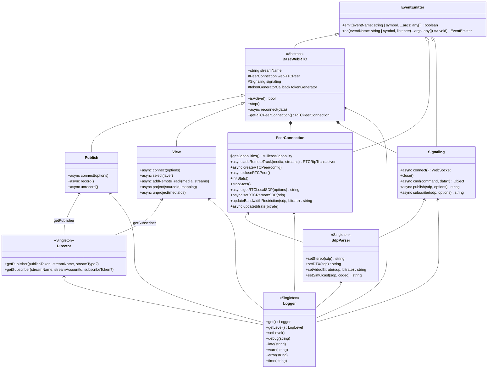

# Develop in Millicast SDK
## Packages
This project is built with [Lerna](https://lerna.js.org/) and contains the following packages:

- `millicast-sdk`: The SDK itself.
- `millicast-publisher-demo`: Publisher demo page using SDK. You can try this demo [here](https://demo.millicast.com/?codec=h264&nosimulcast).
- `millicast-viewer-demo`: Viewer demo page using SDK.
- `millicast-chromecast-receiver`: Example of Google Cast receiver for demo.

## Development
Asumming that you have Node 12.10.x or newer and `npm` installed, install the required dependencies running:
```sh
npm ci
```

### Changesets
Whenever you are working on a new feature, fix or change, make sure you create a **changeset** with a description of the change. Follow [this](.changeset/README.md#Changes-per-feature) guide for further understanding.

### Building packages
As the project is built using [Lerna](https://lerna.js.org/), we can rely on it to manage our packages dependencies, so you just need to run at project's root directory
```sh
npm run prepare
```

Next, to build all packages add a `.env` file in both demo packages (`millicast-publisher-demo`, `millicast-viewer-demo` & `millicast-chromecast-receiver`). You can find the following example in `.env.sample`:
```sh
# Make a .env file with the following vars
MILLICAST_STREAM_NAME=test
MILLICAST_ACCOUNT_ID=test
MILLICAST_PUBLISH_TOKEN=test
```

Then, build all packages:
```sh
npm run build
```

Optionally you can run other Lerna command using `npx lerna [command]`.

### Running demo
If you want to add, fix or edit features in SDK, or just try our demo pages, run:
```sh
npm run start
```
It opens in your browser both demos and keep watching changes in all packages, so you only need to refresh both pages if you add changes in code.

### Running test for WSL users
Read the ['running-test-steps'](developer-wsl-info.md) section of the WSL user guide for instructions on how to resolve common issues that arrive when trying to run local test.

### Building docs
The SDK documentation is written with [JSDcos](https://jsdoc.app/), so to build documentation to get HTMLs files run:
```sh
npx lerna run build-docs
```

Or if you want to navigate docs in your localhost run:
```sh
npx lerna run start-docs --stream
```
In the logs you find the link where you can access to docs. By default is running at http://localhost:5000.

### SDK Components

