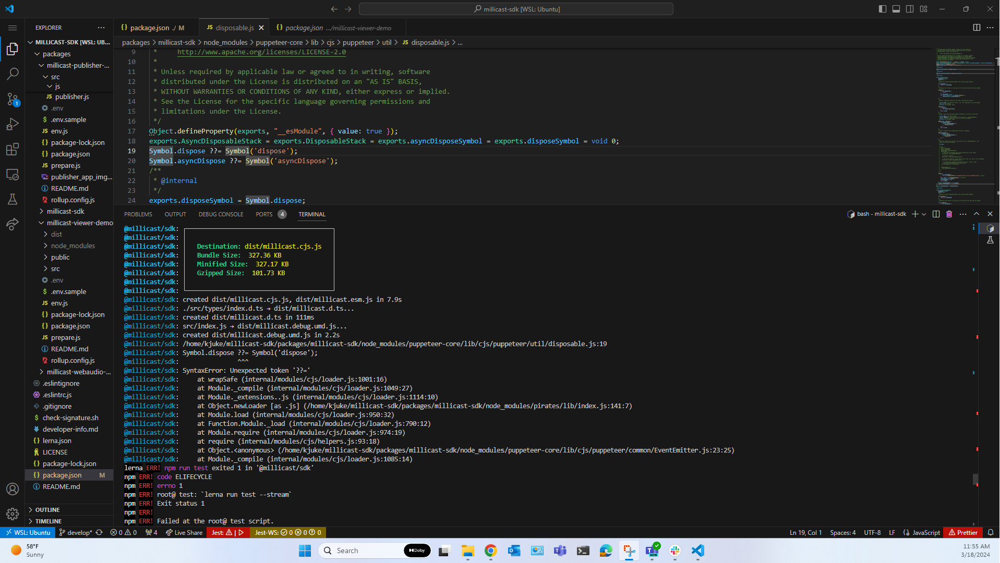
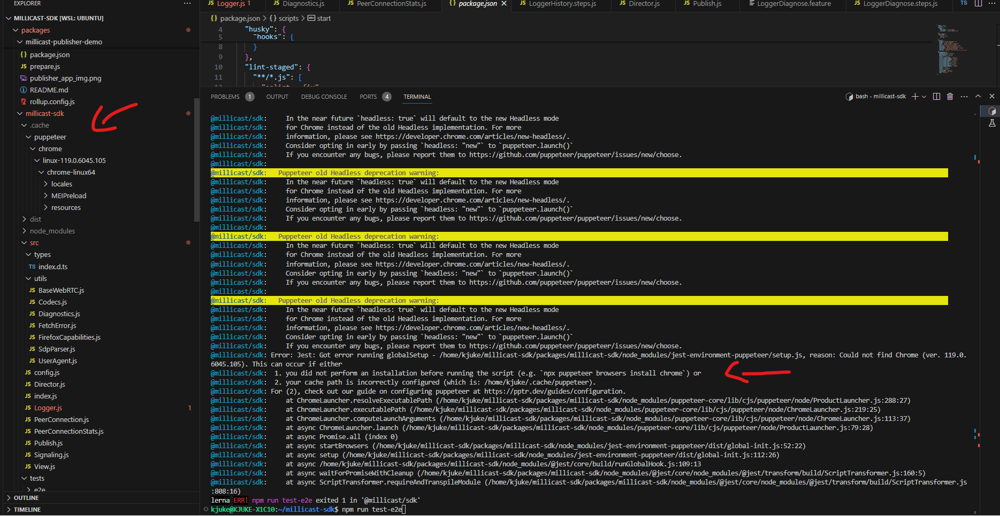

# Develop in Millicast SDK with Windows Subsystem for Linux (WSL)
### Running Test
After completing the general Millicast SDK setup instructions listed in the [developer-info.md](developer-info.md) file, WSL users may experience multiple issues when trying to run test locally.

 - The first issue you may encounter is a SyntaxError occuring at the Puppeteer/util/disposable.js file which will appear in your terminal as an error due to an unexpected "??=" token.

 

 The quick way to resolve this error is by using "nvm use v16.14.0" or any higher version of Node.

 -----------------

 - The second issue you may encounter is due to the current way the Puppeteer file is stored in your global .cache folder located in your machine's root user directory for WSL. This will cause issues when trying to run test as the millicast-sdk sub-directory will not be able to access the Puppeteer folder located in the .cache since its not located within its sub directory. 

 Your terminal will give you an option to resolve the issue by running "npx puppeteer browsers install chrome" or alert you that your cache path is incorrectly configured.

 

 Run the "npx puppeteer browsers install chrome" command and then create a file named 'Puppeteerrc.config' and insert the following contents within it: 

 ```
const { join } = require('path')
 

/**
 * @type {import("puppeteer").Configuration}
 */
module.exports = {
  // Changes the cache location for Puppeteer.
  cacheDirectory: join(__dirname, '.cache', 'puppeteer')
}
 ```

Add your "Puppeteerrc.cjs" file to the global .gitignore file so that its not pushed up to the main repository in github, which could affect Apple/MacOS users.

Next uninstall then reinstall Puppeteer inside the millicast-sdk subdirectory. This should help you fix the issue, but may lead to another error depending on the packages and dependencies you have installed for WSL locally. I will address this below in the third issue resolution. 

 -----------------

 - The third issue you may encounter is due to not having Chrome installed for WSL. Your terminal may display the following error: 
 
 ".cache/puppeteer/chrome/linux-119.0.6045.105/chrome-linux64/chrome: error while loading shared libraries: libxkbcommon.so.0: cannot open shared object file: No such file or directory"

 To install Chrome for WSL you must run through the following [steps](https://learn.microsoft.com/en-us/windows/wsl/tutorials/gui-apps#install-google-chrome-for-linux) through your WSL/Ubuntu terminal: 

1. Change directories into the temp folder: cd /tmp
2. Use wget to download it: "wget https://dl.google.com/linux/direct/google-chrome-stable_current_amd64.deb"
3. Install the package: "sudo apt install --fix-missing ./google-chrome-stable_current_amd64.deb"

*The --fix-missing option is used to fix missing dependencies that may arise during the installation process. The ./ in the command specifies the current directory where the .deb file is located. If the .deb file is located in a different directory, you will need to specify the path to the file in the command.

To launch, enter: "google-chrome"(Chrome should open when running this command)

Afterwards, you must run:

"sudo apt install libgtk-3-dev libnotify-dev libgconf-2-4 libnss3 libxss1 libasound2" 

to install Chrome's required dependencies manually.

 -----------------

After running through these steps, your WSL should be able to run "npm run test" without any errors and see results of running the tests. If everything


