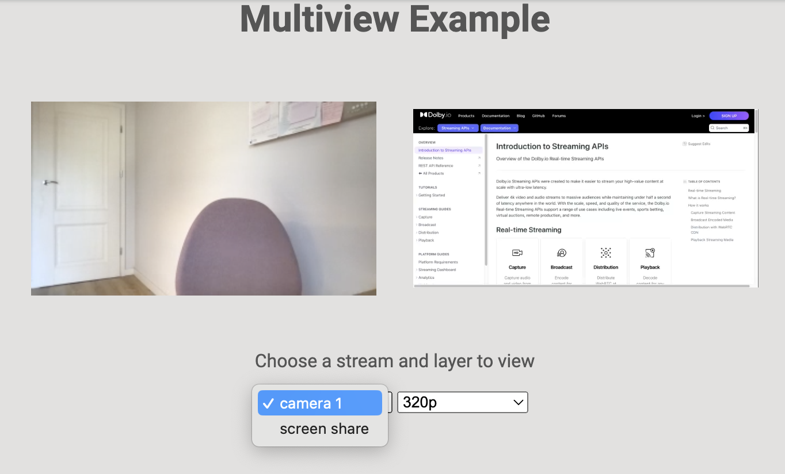

# Millicast Multiview Demo

The Multiview demo application demonstrates multi view playback capabilities that you can add to your application using the Millicast SDK. You can use it for rendering multiple real-time video and audio streams simultaneously inside a browser.



## Getting started

1. Go to the [Dolby.io Streaming dashboard](https://dashboard.dolby.io/) and select your publish token. If you do not have a token, create it by clicking the **create** button.

2. Open the **token details** tab and enable **multisource**.

3. In the same tab, locate and copy your `account ID`.

4. Select the **publishing** tab and copy your `stream name`.

5. Open the Millicast SDK in a code editor, create a `.env` file in the `millicast-multiview-demo` folder, and add the following data to the file: 

```sh
MILLICAST_STREAM_NAME=yourStreamName
MILLICAST_ACCOUNT_ID=yourAccountId
```

This content is also available in the `.env.sample` file.

6. Replace `yourStreamName` and `yourAccountId` with the data copied from the dashboard.

7. Open a terminal in the `millicast-multiview-demo` folder.

8. Install all dependencies:
```sh
npm ci
```
9. Run the application:
```sh
npm start
```

10. Open `http://localhost:10005` and test the application.

To receive streams, you need to broadcast them first. You can do it either via the Dolby.io dashboard by clicking the **broadcast** button, located next to your token, or you can use the [Publisher](../millicast-publisher-demo/) demo application. After you start broadcasting, the Multiview application will be able to play the streamed content. 

The simplest way to receive two streams in the application is to open the dashboard in two browser tabs and start broadcasting a stream from each tab. It additionally requires opening **media settings** via the gear icon and providing a **source ID** for each stream. The ID is a stream name that simplifies stream identification.

The application also lets you select the preferred layer, which refers to a simulcast bitrate. This option is available only after enabling **simulcast** in the **media settings**.

## Custom connect options through URL parameters
This demo application allows the user to set some URL parameters for configuring stream connection options:

| Name             | Description                                         | Default value
| --- | --- | --- |
| **accountId**    | Publisher's account ID                              | `null`
| **streamName**   | Publisher's stream name                             | `null`
| **metadata**     | Enable metadata extraction on all sources available | `false`
| **disableVideo** | Set to disable video from the stream                | `false`
| **disableAudio** | Set to disable audio from the stream                | `false`

