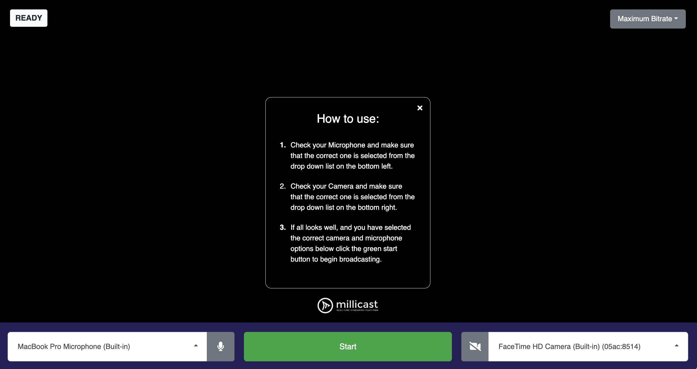

# Millicast Publisher Demo

The Publisher demo application demonstrates broadcasting capabilities that you can add to your application using the Millicast SDK. You can use it to experience and test streaming high-value content with ultra-low latency. The application allows selecting the preferred microphone, camera, and the maximum bitrate and starting broadcasting. 



We recommend using the application together with the [Viewer](../millicast-viewer-demo/) demo application to test the receiving side as well.

## Getting started

1. Go to the [Dolby.io Streaming dashboard](https://dashboard.dolby.io/) and select your token. If you do not have a token, create it by clicking the **create** button.

2. Locate your `account ID` in the **token details** tab and copy the token.

3. Select the **publishing** tab and copy your `publishing token` and `stream name`.

4. Create a `.env` file in the `millicast-publisher-demo` folder and add the following data to the file: 

```sh
MILLICAST_STREAM_NAME=yourStreamName
MILLICAST_ACCOUNT_ID=yourAccountId
MILLICAST_PUBLISH_TOKEN=yourPublishToken
```

This content is also available in the `.env.sample` file.

5. Replace `yourStreamName`, `yourAccountId`, and `yourPublishToken` with the data copied from the dashboard.

6. Open a terminal in the `millicast-publisher-demo` folder.

7. Install all dependencies:
```sh
npm ci
```
8. Run the application:
```sh
npm start
```

9. Open `http://localhost:10001` and test the application.

## Introducing updates
After introducing any changes to the `public` directory, use the following command:
```
npm run prepare
```
