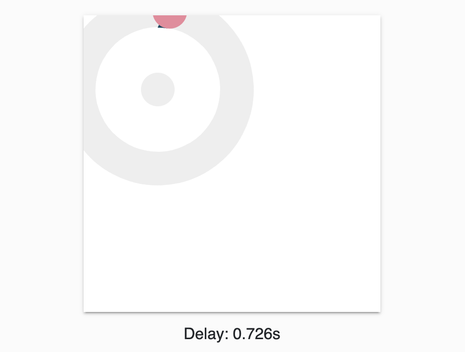

# Millicast WebAudio Delay Demo

The WebAudio Delay demo application lets you interact with audio delay between broadcasting and viewing a Dolby.io real-time stream. By moving the red slider you can increase the latency and compare its impact on your audio.



## Getting started

1. Go to the [Dolby.io Streaming dashboard](https://dashboard.dolby.io/) and select your token. If you do not have a token, create it by clicking the **create** button.

2. Locate your `account ID` in the **token details** tab and copy the token.

3. Select the **publishing** tab and copy your `stream name`.

4. Create a `.env` file in the `millicast-webaudio-delay-demo` folder and add the following data to the file: 

```sh
MILLICAST_STREAM_NAME=yourStreamName
MILLICAST_ACCOUNT_ID=yourAccountId
```

This content is also available in the `.env.sample` file.

5. Replace `yourStreamName` and `yourAccountId` with the data copied from the dashboard.

6. Open a terminal in the `millicast-webaudio-delay-demo` folder.

7. Install all dependencies:
```sh
npm ci
```
8. Run the application:
```sh
npm start
```

9. Open `http://localhost:10003` and test the application.

You need to broadcast a stream to experience the latency. You can do it either via the Dolby.io dashboard by clicking the **broadcast** button, located next to your token, or you can use the [Publisher](../millicast-publisher-demo/) demo application. After you start broadcasting, you can move the red slider in the application to change the latency. To listen to the broadcasted audio, we recommend using the [Viewer](../millicast-viewer-demo/) demo application.

## Introducing updates
After introducing any changes to the `public` directory, use the following command:
```
npm run prepare
```